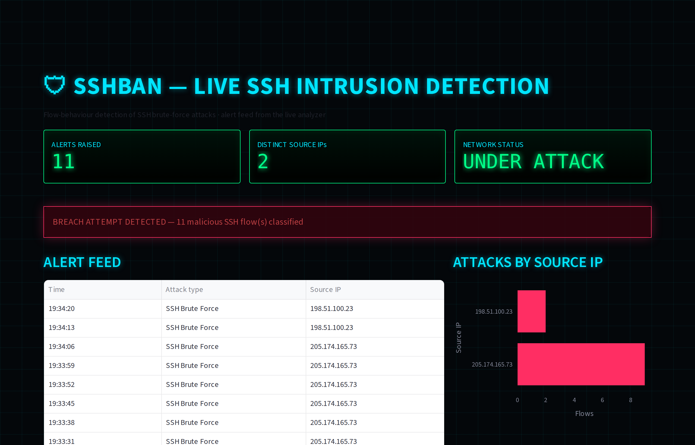
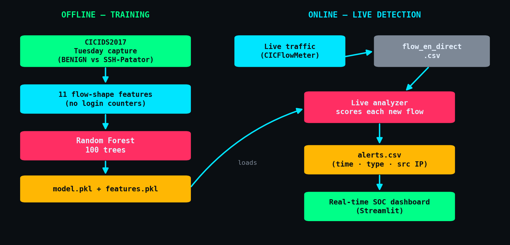
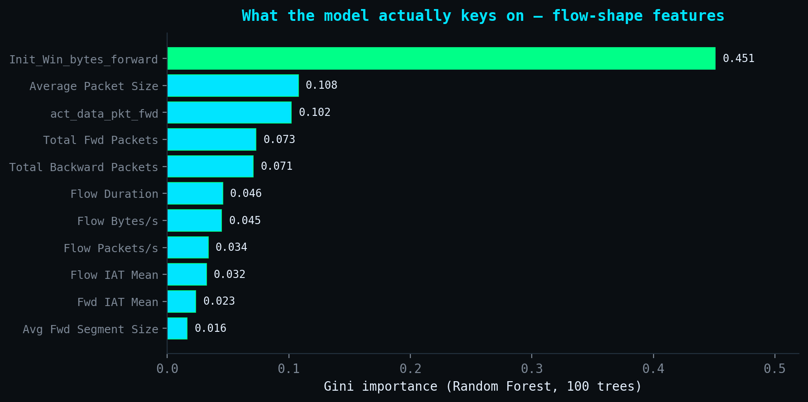

<div align="center">

# SSHban

### Behavioural detection of SSH brute-force attacks — from the *shape* of network traffic, not from failed-login counters.

[](https://www.python.org/)
[](https://scikit-learn.org/)
[](https://streamlit.io/)
[](https://www.unb.ca/cic/datasets/ids-2017.html)
[](https://github.com/AhmedBenRahma/SSHban/actions/workflows/ci.yml)
[](LICENSE)

</div>

**SSHban classifies the behaviour of a network flow** — its duration, packet counts, byte rates and inter-arrival timing — to decide whether it is a human SSH session or an automated brute-force attack. Because it never looks at a login counter, it catches the attacks `fail2ban` misses: the slow ones paced under the ban window, and the distributed ones spread across many source IPs.

Trained on **CICIDS2017** and validated end to end against **real Hydra attacks** launched from a Kali Linux VM against a Windows 11 OpenSSH host.

<div align="center">



*The live SOC dashboard during an attack — real model output, scored flow by flow.*

</div>

---

## Table of contents

- [Why flow behaviour beats login counters](#why-flow-behaviour-beats-login-counters)
- [How it works](#how-it-works)
- [What the model keys on](#what-the-model-keys-on)
- [Quickstart](#quickstart)
- [The live pipeline](#the-live-pipeline)
- [Results & validation](#results--validation)
- [Project layout](#project-layout)
- [Testing](#testing)
- [Scope & honest limitations](#scope--honest-limitations)
- [Tech stack](#tech-stack)

---

## Why flow behaviour beats login counters

SSH on a public IP is attacked constantly. The usual defence — `fail2ban` and friends — counts failed logins per IP and bans past a threshold. That works against noisy attacks and fails against the quiet ones:

- an attacker who **spreads attempts across many source IPs** never trips a per-IP counter;
- an attacker who **paces attempts below the ban window** stays under the threshold indefinitely.

SSHban uses a signal the attacker cannot easily shape around: the **statistical shape of the network flow itself**. A brute-force session — many tiny, rapid-fire connection attempts — looks nothing like a human SSH session at the flow level, whatever the retry rate. Detection does not depend on a threshold an attacker can measure and stay under.

## How it works



Two paths share one feature contract:

- **Offline (training).** The Tuesday capture of CICIDS2017 — labelled `BENIGN` traffic and a real `SSH-Patator` brute-force campaign — is reduced to **11 flow-shape features** and used to train a **Random Forest** (`sshban train`).
- **Online (detection).** A live capture tool (CICFlowMeter) writes flow records to a CSV; `sshban detect` scores every new flow with the trained model and appends any attack to `alerts.csv`; the **Streamlit dashboard** renders that feed in real time.

## What the model keys on

Every decision is auditable. The Random Forest leans on intuitive, behavioural signals — led by the initial TCP window and the packet-size / payload profile — not on any single opaque cue:



## Quickstart

```bash
git clone https://github.com/AhmedBenRahma/SSHban.git
cd SSHban
pip install -r requirements.txt        # or: pip install -e .
```

The trained model ships in `models/`, so you can run the whole demo immediately — **no dataset or GPU required.**

## The live pipeline

Three terminals show the full path from traffic to alert. The bundled simulator emits flows the **trained model genuinely classifies** (the attack signature was derived from the model's own decision regions), so you can see real detections without a Kali VM:

```bash
# 1) emit a demo flow stream (benign traffic, then an attack burst)
sshban simulate

# 2) score new flows and raise alerts
sshban detect --flow flow_en_direct.csv

# 3) watch the alerts land on the live dashboard
sshban dashboard
```

To run against **real traffic**, point [CICFlowMeter](https://github.com/ahlashkari/CICFlowMeter) at your interface, have it write `flow_en_direct.csv`, and run steps 2–3.

> 📹 **[Watch the full demo](demo/ssh_attack_demo.mp4)** — a live Hydra brute-force from Kali against a Windows 11 OpenSSH host, detected as it happens.

A second, host-side dashboard (`sshban/dashboards/windows_ssh.py`) reads the Windows **OpenSSH event log** directly, for defenders who want a log-based view alongside the network-flow detector.

## Results & validation

- **Dataset.** CICIDS2017 (Tuesday), filtered to `BENIGN` vs `SSH-Patator`; 11 flow features; 80/20 stratified split.
- **Model.** Random Forest, 100 trees. SSH-Patator is highly separable from benign traffic at the flow level, and the detector reaches **≈0.99 F1 on the held-out split** — reproduce it end to end with `sshban train --data <cicids2017_tuesday.csv>` (the script prints the classification report and confusion matrix).
- **Live validation.** Beyond the dataset, the pipeline was validated against **real Hydra attacks** (`hydra -l <user> -P passwords.txt ssh://<host>`) launched from Kali against a Windows 11 OpenSSH host — the attack surfaces on the dashboard within seconds (see the demo video).

## Project layout

```
SSHban/
├── sshban/
│   ├── features.py           # the 11-feature contract (single source of truth)
│   ├── train.py              # train the Random Forest on CICIDS2017
│   ├── detect.py             # LiveAnalyzer: score live flows -> alerts.csv
│   ├── simulate.py           # emit a model-triggering demo flow stream
│   ├── cli.py                # `sshban train|detect|simulate|dashboard`
│   └── dashboards/
│       ├── live.py           # real-time SOC dashboard (flow alerts)
│       └── windows_ssh.py    # host-side view (Windows OpenSSH log)
├── models/                   # trained model.pkl + features.pkl (shipped)
├── data/sample_flow.csv      # sample flows to try `sshban detect` on
├── demo/ssh_attack_demo.mp4  # live Hydra attack, detected
├── tests/                    # pytest suite (feature contract, detection, simulation)
├── docs/                     # architecture, feature importance, dashboard
└── .github/workflows/ci.yml  # CI: install + tests on every push
```

## Testing

```bash
pytest -q
```

The suite locks the feature contract, checks that the shipped model flags the attack signature and clears a benign session, and verifies the simulator's output — the same checks CI runs on every push.

## Scope & honest limitations

Stated plainly, because a tool nobody has stress-tested is a tool nobody should trust:

- **Lab-validated, not production-hardened.** This is a detection pipeline built and validated in a lab; it is not a hardened, deployed IDS.
- **One attack family, one dataset.** Trained on `SSH-Patator` in CICIDS2017. Other brute-force tools or a different network would likely need retraining, since the flow-feature distributions differ.
- **Detection, not prevention.** SSHban raises alerts; it does not itself block traffic. Wiring an alert to a firewall rule is the natural next step.
- **Depends on flow extraction.** Live detection assumes a flow exporter (CICFlowMeter) producing the CICIDS2017 feature columns.

## Tech stack

Python · scikit-learn · pandas · Streamlit · Plotly · CICFlowMeter · CICIDS2017

## Author

**Ahmed Ben Rahma** — Software Engineering student at ENSI, Tunisia.
[GitHub](https://github.com/AhmedBenRahma) · MIT License.
