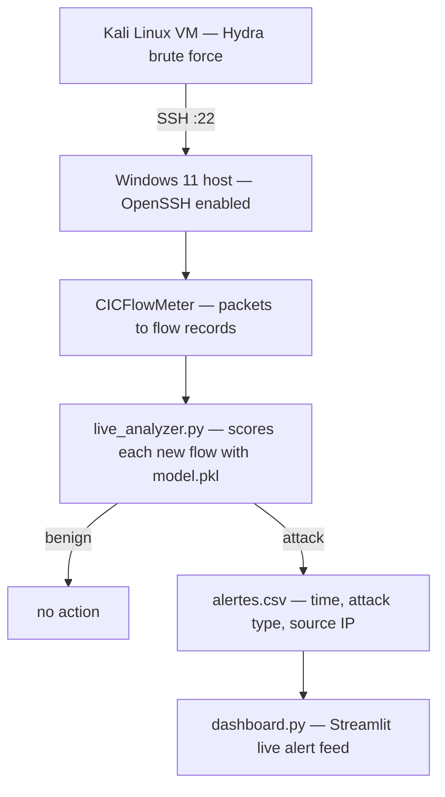

# SSHban — Real-Time SSH Brute-Force Detection

[](https://www.python.org/)
[](https://scikit-learn.org/)
[](https://streamlit.io/)
[](https://www.unb.ca/cic/datasets/ids-2017.html)
[]()
[](LICENSE)

**A network-flow intrusion detector that spots SSH brute-force attacks from traffic
behaviour instead of failed-login counters, and raises alerts on a live dashboard
within seconds.**

Trained on CICIDS2017, validated end to end against real Hydra attacks launched
from a Kali Linux VM against a Windows 11 OpenSSH host.

---

## Table of contents

- [Why this project](#why-this-project)
- [Demo](#demo)
- [How it works](#how-it-works)
- [Detection model](#detection-model)
- [Results](#results)
- [Quickstart](#quickstart)
- [Repository layout](#repository-layout)
- [Limitations and next steps](#limitations-and-next-steps)
- [Tech stack](#tech-stack)
- [References](#references)

---

## Why this project

SSH on a public IP gets hit constantly. The usual defence — `fail2ban` and friends —
counts failed logins per IP and bans past a threshold. That works against noisy
attacks and fails against the quiet ones: an attacker who spreads attempts across
many source IPs, or paces them below the ban window, never trips the counter.

This project takes a different signal. Instead of counting logins, it classifies
the **shape of the network flow** — duration, packet counts, byte rates,
inter-arrival timing. A brute-force session looks different from a human SSH
session at the flow level, whatever the retry rate, so detection does not depend
on a threshold an attacker can measure and stay under.

The scope is honest: this is a detection pipeline built and validated in a lab,
not a hardened production IDS. What it demonstrates is the full path from a public
research dataset to a model scoring live traffic and raising an alert a human can act on.

## Demo


*`dashboard.py` during an attack — the banner carries the most recent detection, the
table below it the running alert feed. Source IP `205.174.165.73` is the attacker
host from the CICIDS2017 capture.*

📹 Full screen recording of a live Hydra attack being detected:
**[demo attaque ssh.mp4](demo%20attaque%20ssh.mp4)**

## How it works



Two detection paths are included:

| Path | Entry point | Signal | Use it when |
|------|-------------|--------|-------------|
| **Flow-based (main)** | `live_analyzer.py` → `dashboard.py` | Network flow features scored by the trained model | You have CICFlowMeter producing live flow records |
| **Log-based** | `ids_dashboard.py` | Windows `OpenSSH/Operational` event log read over PowerShell | You want host-side visibility without a flow exporter |

The flow-based path is the one the model serves. The log-based dashboard is a
complementary host view: it reads failed-authentication events directly, charts
attempts per minute, and flags a network status of `SÉCURISÉ` / `ALERTE` /
`CRITIQUE` from the failure count.

## Detection model

**Dataset** — [CICIDS2017](https://www.unb.ca/cic/datasets/ids-2017.html),
`Tuesday-WorkingHours.pcap_ISCX.csv`, filtered to two classes:

| Class | Flows | Share |
|-------|------:|------:|
| BENIGN | 432,074 | 98.7% |
| SSH-Patator (attack) | 5,897 | 1.3% |

**Features** — 11 flow statistics, chosen because they describe *rhythm and volume*
rather than payload, so the model never needs to decrypt anything:

| Group | Features |
|-------|----------|
| Volume | `Total Fwd Packets`, `Total Backward Packets`, `act_data_pkt_fwd` |
| Rate | `Flow Bytes/s`, `Flow Packets/s` |
| Size | `Average Packet Size`, `Avg Fwd Segment Size`, `Init_Win_bytes_forward` |
| Timing | `Flow Duration`, `Flow IAT Mean`, `Fwd IAT Mean` |

**Training** — `RandomForestClassifier(n_estimators=100, random_state=42)`, on an
80/20 stratified split, with infinite and missing values dropped before fitting.
Training takes roughly 30 seconds on a laptop CPU.

## Results

Held-out test set — 87,542 flows:

| Metric | Benign | SSH-Patator |
|--------|-------:|------------:|
| Precision | 100% | 100% |
| Recall | 100% | 99% |
| F1-score | 100% | 100% |

**Confusion matrix**

|  | Predicted benign | Predicted attack |
|---|---:|---:|
| **Actual benign** | 86,361 | 2 |
| **Actual attack** | 6 | 1,173 |

Two false alarms in 86,363 benign flows, and 6 attack flows missed out of 1,179.
In operational terms: an analyst using this would see roughly one false alert per
43,000 benign connections, and a brute-force session — which produces many flows,
not one — would have to go 6-for-6 unlucky to pass unnoticed.

> **Read these numbers with care.** They come from a single capture day of one
> public dataset, where SSH-Patator traffic is generated by a tool and is cleanly
> separable. Scores this high say the dataset is easy, not that the problem is
> solved — see [Limitations](#limitations-and-next-steps).

## Quickstart

**Prerequisites** — Python 3.10+, and [CICFlowMeter](https://github.com/ahlashkari/CICFlowMeter)
if you want to score live traffic rather than the simulator.

```bash
git clone https://github.com/AhmedBenRahma/SSHban.git
cd SSHban
pip install -r requirements.txt
```

**1. Train the model**

Download `Tuesday-WorkingHours.pcap_ISCX.csv` from
[CICIDS2017](https://www.unb.ca/cic/datasets/ids-2017.html) into the repository root, then:

```bash
python model.py
```

Writes `model.pkl` and `features.pkl`, and prints the classification report and
confusion matrix above.

**2. Start the live analyzer**

```bash
python live_analyzer.py
```

Polls `flow_en_direct.csv` every 2 seconds, scores new flow records, and appends
any detection to `alertes.csv` as `time, attack type, source IP`.

**3. Start the dashboard** (separate terminal)

```bash
streamlit run dashboard.py     # flow-based alert feed
# or
streamlit run ids_dashboard.py # host-side OpenSSH event log view (Windows)
```

Open <http://localhost:8501>.

**4. Trigger an attack**

```bash
# Option A — simulator, no VM needed: writes benign flows then attack flows
python simulate_attack.py

# Option B — real attack from Kali Linux
hydra -l administrator -P /usr/share/wordlists/rockyou.txt ssh://<WINDOWS_IP>
```

The alert appears on the dashboard within one polling cycle.

## Repository layout

```
SSHban/
├── model.py              # Train the Random Forest, print metrics, save model.pkl + features.pkl
├── live_analyzer.py      # Score live flow records, append detections to alertes.csv
├── dashboard.py          # Streamlit dashboard: live alert feed
├── ids_dashboard.py      # Streamlit dashboard: Windows OpenSSH event log view + attacks/minute chart
├── simulate_attack.py    # Generate benign then attack flow records, for demo without a VM
├── check_columns.py      # Inspect CICIDS2017 column names
├── test.py               # Quick label sanity check
├── model.pkl             # Trained classifier (regenerate with model.py)
├── features.pkl          # Feature list used at train and inference time
└── demo attaque ssh.mp4  # Screen recording of a detected attack
```

## Limitations and next steps

Stated plainly, because a detector nobody has stress-tested is a detector nobody
should trust:

- **Single-dataset evaluation.** One capture day, one attack tool (Patator).
  Generalisation to other tools and networks is untested — the next step is
  cross-day and cross-dataset validation.
- **Class imbalance.** Attacks are 1.3% of flows, so accuracy is a flattering
  metric; recall and precision on the attack class are the ones that matter, which
  is why they are reported separately above.
- **Slow and distributed attacks are unproven.** The evaded-threshold argument in
  [Why this project](#why-this-project) is the motivation, not yet a measured
  result. Testing against rate-limited Hydra runs is the obvious experiment.
- **The simulator uses extreme values.** `simulate_attack.py` writes deliberately
  saturated feature values, so it proves the plumbing end to end, not the model's
  discrimination. Use real captured flows to judge accuracy.
- **Detection only, no response.** No automatic blocking. Wiring detections to a
  firewall rule (Windows Firewall, `iptables`) is the natural next feature.
- **Feature drift across CICFlowMeter versions.** Column names differ between
  releases; `check_columns.py` exists to catch that before it silently breaks
  inference.

## Tech stack

| Layer | Technology |
|-------|-----------|
| Model | scikit-learn (Random Forest) |
| Data | pandas, numpy, CICIDS2017 |
| Flow capture | CICFlowMeter |
| Dashboards | Streamlit, Plotly |
| Attack generation | Hydra on Kali Linux |
| Target host | Windows 11 with OpenSSH Server |

## References

- Sharafaldin, I., Lashkari, A. H., & Ghorbani, A. A. (2018). *Toward Generating a
  New Intrusion Detection Dataset and Intrusion Traffic Characterization.* ICISSP.
- [CICIDS2017 dataset](https://www.unb.ca/cic/datasets/ids-2017.html) — Canadian
  Institute for Cybersecurity
- [CICFlowMeter](https://github.com/ahlashkari/CICFlowMeter) — network flow feature extractor

## Author

**Ahmed Ben Rahma** — Software Engineering student at ENSI, Tunisia.
[LinkedIn](https://www.linkedin.com/in/ahmed-ben-rahma-183725329/) ·
[GitHub](https://github.com/AhmedBenRahma)

Built as an academic cybersecurity project. Released under the MIT License.
